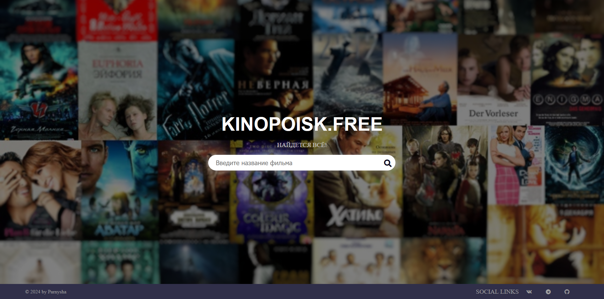
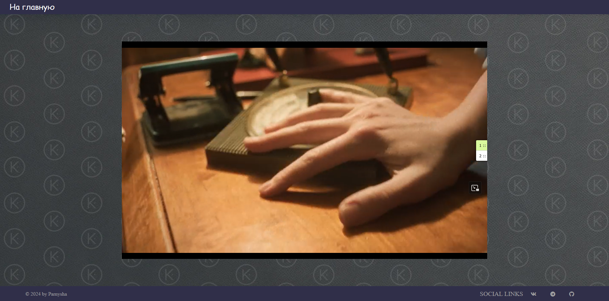

# Kinopoisk.free
Сервис для просмотра фильмов без рекламы, впнов и прочего.
- [Сам сайт](https://bbatv55g2fp0sftdbose.containers.yandexcloud.net/)
## Дизайн
| Главная страница          | Страница с фильмом        |
|---------------------------|---------------------------|
|  |  |
## Содержание
- [Дизайн](#Дизайн)
- [Технологии](#технологии)
- [Разработка](#разработка)

## Технологии
- [JavaScript](https://ecma-international.org/publications-and-standards/standards/ecma-262/)
- [Java 21](https://www.java.com/ru/)
- [Spring](https://spring.io/)
- [Jsoup](https://jsoup.org/)
- [Kinobox API](https://kinobox.tv/api/)
- [Maven](https://maven.apache.org/)

## Использование

Если сайт недоступен по ссылке, можете попробовать развернуть его при помощи докера на своей машине.

1. Склонируйте к себе репозиторий.
```sh
$ git clone https://github.com/parnysha/pirateWatch.git 
```
2. Упакуйте свой проект при помощи Maven.
```sh
$ mvn clean package
```
3. Соберите Docker-image.
```sh
$ docker build -t kinopoisk-fake:0.0.1 .
```
4. Запустите Docker-container.
```sh
$ docker run -d -p 8080:8080 -t kinopoisk-fake:0.0.1
```
5. Проверьте работоспособность.
```sh
$ curl http://localhost:8080
```
